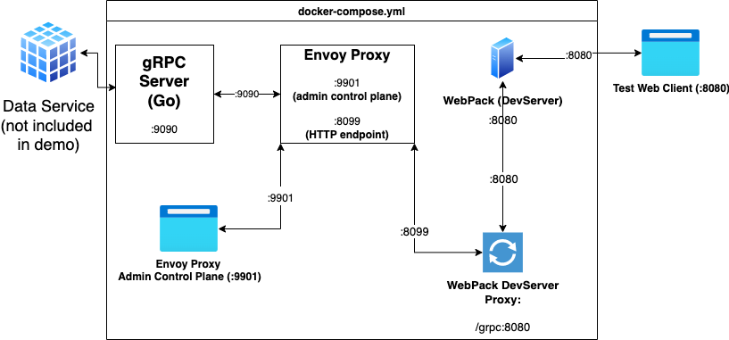

# grpc-envoy-template

## Overview

This repo is a template/example for implementing a protobuf-base microservice running on a gRPC + Envoy Proxy + gRPC-web stack. (Acronym pending..."GREWP"?)

## Quick Start

### Prerequsites

- Architecture: ARM64 or x86_64
- OS: Tested on Linux and MacOS (probably doesn't work on Windows unless using WSL2)
- Software/Libraries:
  - Docker
    - `docker-compose` 
  - `Go`, if you want to run the Go test gRPC client.

### Steps

1. Clone the repo
2. `make start-server` or `docker-compose up`
3. Point your browser to `http://localhost:8080`

## Use Case

[Protocol Buffers](https://developers.google.com/protocol-buffers/docs/proto3) provide a cross-language framework to define and implement data structures.

[gRPC](https://grpc.io/) is a cross-platform transport layer of similar utility - most commonly utilized for transporting protobuf messages via remote procedure calls.

Ideally, across all layers of an application, protobufs and gRPC could be used for purposes of implmenting a microservice. However, web browsers currently cannot natively operate as gRPC clients.

When using Typescript for front-end development, the utility of protobufs is apparent, as auto-generation of Typescript code from protobufs saves enormous time through reducing the amount of boilerplate code - and the ability to autogenerate code if a protobuf definition changes. 

However, browsers cannot currently operate as native gRPC clients. The node-based libraries [@protobuf-ts](https://www.npmjs.com/package/@protobuf-ts) and [grpc-web](https://github.com/grpc/grpc-web) provide an implementation of gRPC via HTTP 1.x. This implementation, however, requires a proxy server between the gRPC server and the web-based client.

## Motivation

I prefer to work with strongly typed languages from the data layer API to the front end - currently for me, that approach implements Go on the backend, TypeScript on the front end, and pre-defined schemas via ORMs for SQL databases and Go-based structures (generated from protobufs) for NoSQL databases such as MongoDB.

Getting this stack operating involves a lot of moving parts, from compiling the protobuf defs with `protoc` to implementing the transport layer on the web client side.

Despite this complexity, I would still rather define a structure and RPC once and use it everywhere - from data layer to front-end - than hard code in data structure transformations.

Though cobbling together of example code scattered in a few repos (some of which is out-of-date), and many points of failure, I ended up with a template for a stack that works well for my purposes.

This repo is a standard-ish template that I've built on to impement this sort of microservice stack. I'm sharing this template to both save time for others, and to solicit suggestions and recommendations for improvements.

## Topology

### Diagram

### Description

The `docker-compose` file operates a container running a gRPC server, running in a more-or-less standard implementation in Go.

Another container, operating in the same `docker-compose` network, is running the Envoy proxy. 

The test client (React + Webpack) interfaces with the Envoy Proxy via a Webpack proxy. This Webpack proxy is utilized to avoid CORS-related issues by presenting the Envoy HTTP layer on the same port and host name (`localhost`) as the Webpack server. (The envoy proxy re-writes the incoming prefix from the Webpack proxy.)

## Important Info

The code and templates in this repo are for development and testing purposes only. __Do not start plug the `docker-compose` container directly onto the pubic internet.__

_Actual production implementation of this stack should have a scalable microserice per container, communicating via TLS, and with network access to ports carefully reviewed.

Code and repo is licensed under the MIT License. 

## Notes

### Edit and Recompilation of Source Files

The `Makefile` should contain most of the commands needed to re-compile/transpile both the Go gRPC code and the Typescipt code via `make build`.

### FAQs

#### Why didn't you use Twirp?

I have implemented [Twirp](https://github.com/twitchtv/twirp) in other projects.

##### Advantages:

- Twirp is most definitely "easier" in that only a single Go process/program is needed - a proxy server mashed into a written-from-scratch HTTP[S] gRPC server.

- Twirp can also be implemented under Echo or another Go HTTP server, again, making things a bit more straightfoward.

##### Disadvantages

- Doesn't support server -> client streaming.
- I prefer to use the reference implementation of a gRPC server, rather than Twirp's representation. There are some quirks to Twirp's implementation that could have impacted future projects, and I'd rather not have to spend time on those types of issues.
- If I am implementing protobuf-based processes on native clients, I can hypothetically run one gRPC-based server for all clients, rather than a Twirp server and another native gRPC server.
